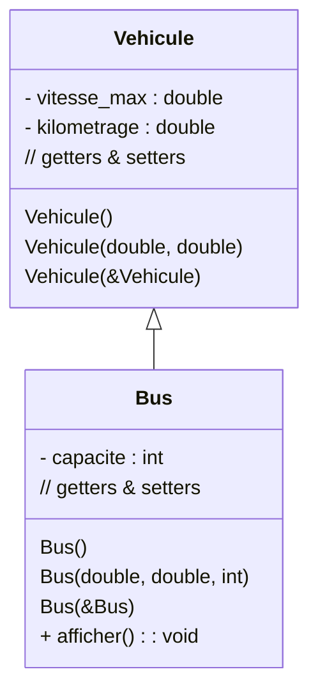

# POO_wshp_3

## Vehicule 

```mermaid
classDiagram
class Vehicule{
    - vitesse_max : double
    - kilometrage : double
    Vehicule()
    Vehicule(double, double)
    Vehicule(&Vehicule)
    // getters & setters
}

class Bus{
    - capacite : int
    Bus()
    Bus(double, double, int)
    Bus(&Bus)
    // getters & setters
    + afficher() : void
}

Vehicule <|--Bus

```