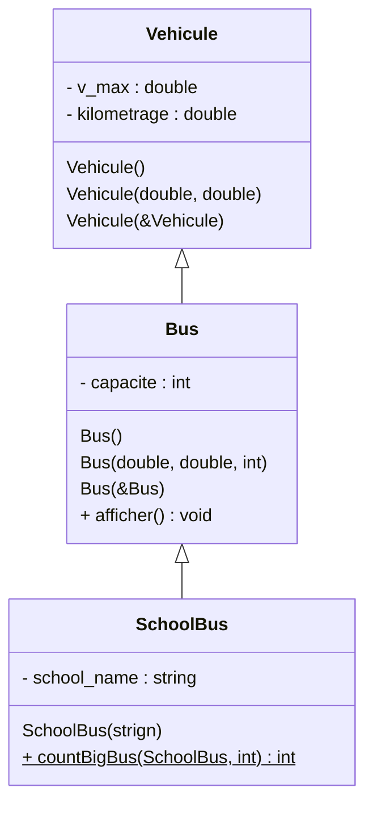
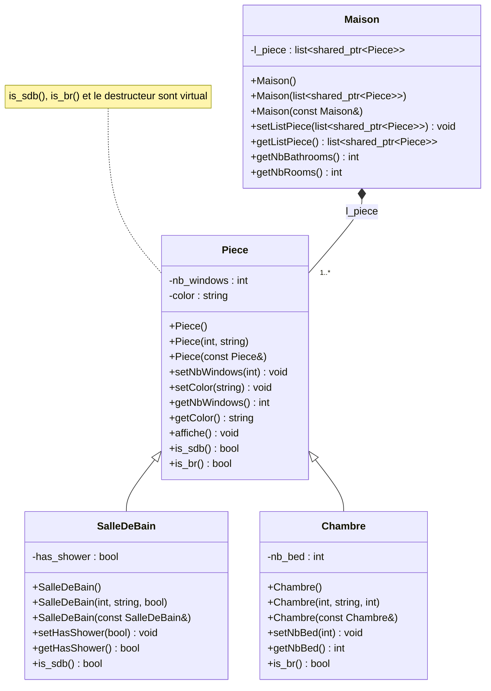

# POO_wshp_3

## Vehicule 

```mermaid
classDiagram
class Vehicule{
    - v_max : double
    - kilometrage : double
    Vehicule()
    Vehicule(double, double)
    Vehicule(&Vehicule)
    %% getters & setters
}

class Bus{
    - capacite : int
    Bus()
    Bus(double, double, int)
    Bus(&Bus)
    %% getters & setters
    + afficher() void
}

class SchoolBus{
    - school_name : string
    SchoolBus(strign)
    %% getter & setter
    + countBigBus(SchoolBus, int)$ int
}

Vehicule <|--Bus
Bus<|--SchoolBus

```
## Maison 

```mermaid
classDiagram
    class Piece {
        -nb_windows : int
        -color : string
        +Piece()
        +Piece(int, string)
        +Piece(const Piece&)
        +setNbWindows(int) void
        +setColor(string) void
        +getNbWindows() int
        +getColor() string
        +affiche() void
        +is_sdb() bool
        +is_br() bool
    }

    class SalleDeBain {
        -has_shower : bool
        +SalleDeBain()
        +SalleDeBain(int, string, bool)
        +SalleDeBain(const SalleDeBain&)
        +setHasShower(bool) void
        +getHasShower() bool
        +is_sdb() bool
    }

    class Chambre {
        -nb_bed : int
        +Chambre()
        +Chambre(int, string, int)
        +Chambre(const Chambre&)
        +setNbBed(int) void
        +getNbBed() int
        +is_br() bool
    }

    class Maison {
        -l_piece : list~shared_ptr~Piece~~
        +Maison()
        +Maison(list~shared_ptr~Piece~~)
        +Maison(const Maison&)
        +setListPiece(list~shared_ptr~Piece~~) void
        +getListPiece() list~shared_ptr~Piece~~
        +getNbBathrooms() int
        +getNbRooms() int
    }

    Piece <|-- SalleDeBain
    Piece <|-- Chambre
    Maison *-- "1..*" Piece : l_piece

    note for Piece "is_sdb(), is_br() et le destructeur sont virtual"
```